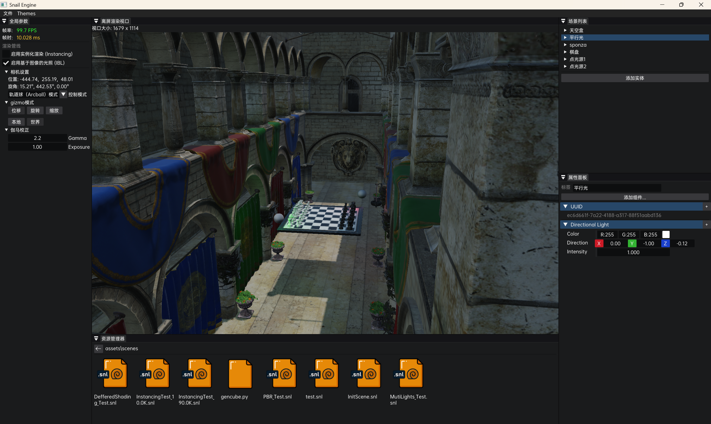
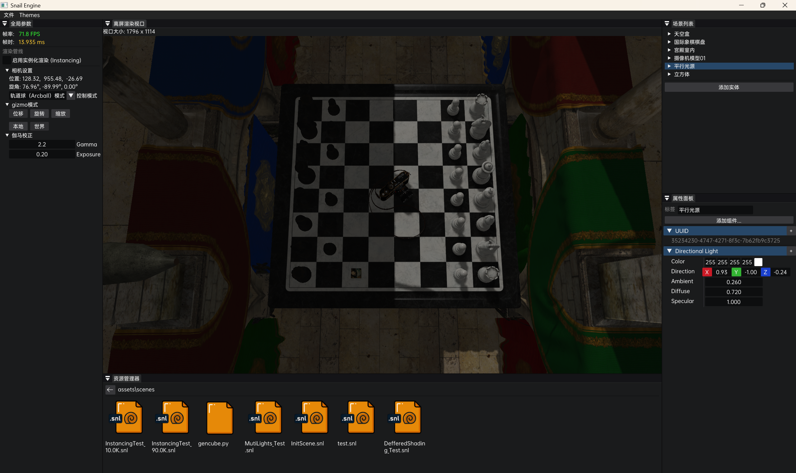
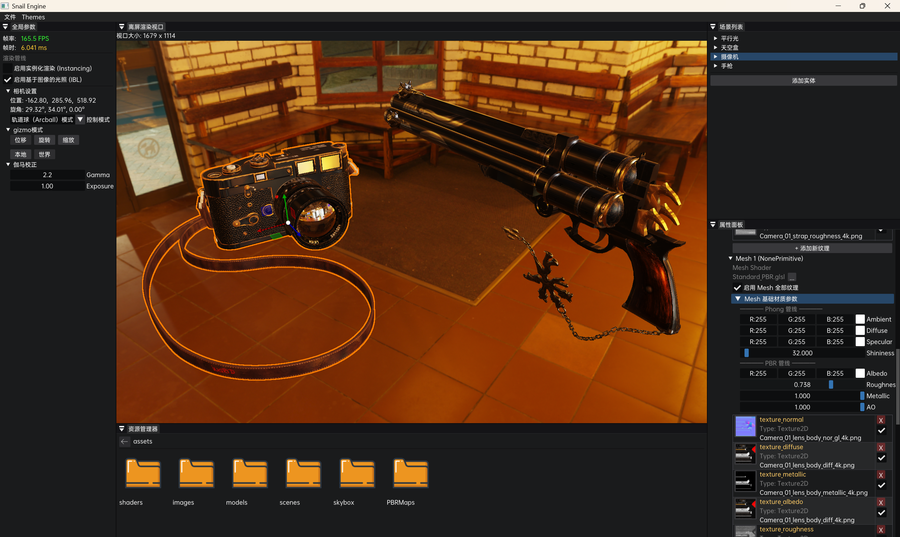
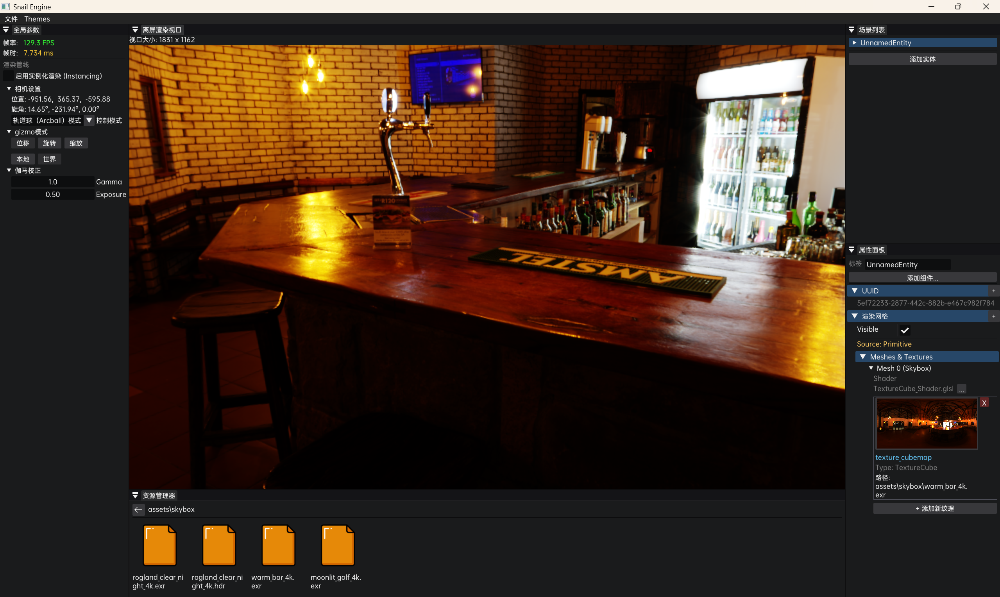
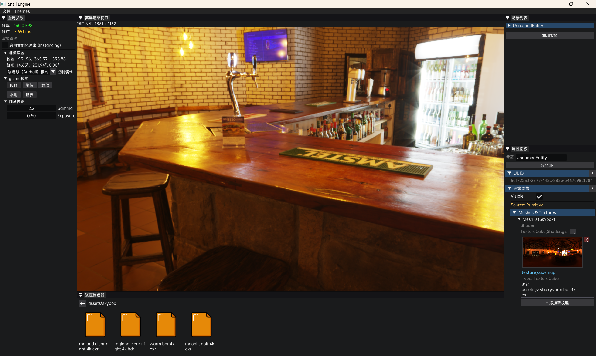

[**中文版 README**](./README_ZH.md)

# Snail

## I. Introduction

A model rendering system (game engine) project based on OpenGL, built upon the early architecture of TheCherno's game engine series projects. The 3D techniques are derived from: <https://learnopengl-cn.github.io/>.


## II. Project Configuration

Clone the project:

```
git clone https://github.com/Hanbly/Snail.git
```

Initialize submodules:

```
git submodule update --init
```

Run the `GenProject.bat` batch file in the root directory to execute the premake command and generate the Visual Studio solution. The project currently only supports Windows.


## III. Engine

Please obtain example model assets yourself.

### Operation Manual

| **Category**           | **Action**          | **Key / Input**        | **Detailed Description**                                     |
| ---------------------- | ------------------- | ---------------------- | ------------------------------------------------------------ |
| **Object Interaction** | Select Object       | Mouse Left             | Click object to select; Drag Gizmo to move/rotate/scale.     |
|                        | Multi-select        | Left Ctrl + Mouse Left | Hold Ctrl and click object to add to current selection; Gizmo is active in this state. |
|                        | Axis Only           | Space + Mouse Left     | Disable object selection functionality, only respond to Gizmo operations. |
| **View Control**       | Rotate View         | Mouse Middle Drag      | FPS and Arcball modes. Hold middle button and drag to rotate view. |
|                        | Pan View            | Alt + Mouse Middle     | Arcball mode. Hold Alt and drag middle button to pan view center. |
|                        | Adjust FOV/Distance | Mouse Scroll           | FPS mode: Adjust Field of View (FOV); Arcball mode: Adjust view distance (Dolly/Zoom). |
|                        | Scene Roaming       | W / A / S / D          | FPS mode. Move camera position Forward / Left / Back / Right. |
|                        | Vertical Elevation  | Q / E                  | FPS mode. Descend (Q) / Ascend (E) camera height.            |

### Object Selection:


### Simple Asset Browser:


### Multi-light Scene:



### Directional Light Shadow Mapping:



### PBR Pipeline and IBL:



*Model by [Andrew Maximov] from [https://artisaverb.info/PBT.html]*

*Model by [Riley Queen] from [https://polyhaven.com/models]*

*Model by [Rajil Jose Macatangay] from [https://polyhaven.com/models]*

### HDRI Support and Gamma Correction:





*HDRI by [**Greg Zaal** & **Jarod Guest**] from [https://polyhaven.com/hdris]*

### Instanced Rendering (360K+ Vertex Data):


> glm lacks optimization in debug mode, run with caution in debug mode;
>
> This project uses text serialization and deserialization, be cautious when rendering larger amounts of vertex data.


## IV. Third-party Libraries

The integrated libraries and their official repository addresses are as follows:

| **Component Name**            | **Library Name** | **Official GitHub Link**                      |
| ----------------------------- | ---------------- | --------------------------------------------- |
| Logging System                | spdlog           | <https://github.com/gabime/spdlog>            |
| Window Management             | GLFW             | <https://github.com/glfw/glfw>                |
| OpenGL Loader                 | GLAD             | <https://github.com/Dav1dde/glad>             |
| Mathematics                   | GLM              | <https://github.com/g-truc/glm>               |
| Image Loading                 | stb_image        | <https://github.com/nothings/stb>             |
| exr Loading                   | tinyexr          | <https://github.com/syoyo/tinyexr>            |
| Compressed File Processing    | miniz            | <https://github.com/richgel999/miniz>         |
| Debug Interface               | Dear ImGui       | <https://github.com/ocornut/imgui>            |
| File Dialog                   | ImGuiFileDialog  | <https://github.com/aiekick/ImGuiFileDialog>  |
| Gizmo                         | ImGuizmo         | <https://github.com/CedricGuillemet/ImGuizmo> |
| Model Import                  | Assimp           | <https://github.com/assimp/assimp>            |
| Entity Component System (ECS) | EnTT             | <https://github.com/skypjack/entt>            |
| UUID                          | Boost.UUID       | <https://github.com/boostorg/uuid>            |
| Serialization                 | yaml-cpp         | <https://github.com/jbeder/yaml-cpp>          |

> Note:
>
> - stb_image: Image-related headers only
> - tinyexr: Currently does not support DWAA & DWAB compressed format resources
> - miniz: Header only, it is the built-in version of tinyexr
> - EnTT: Header only