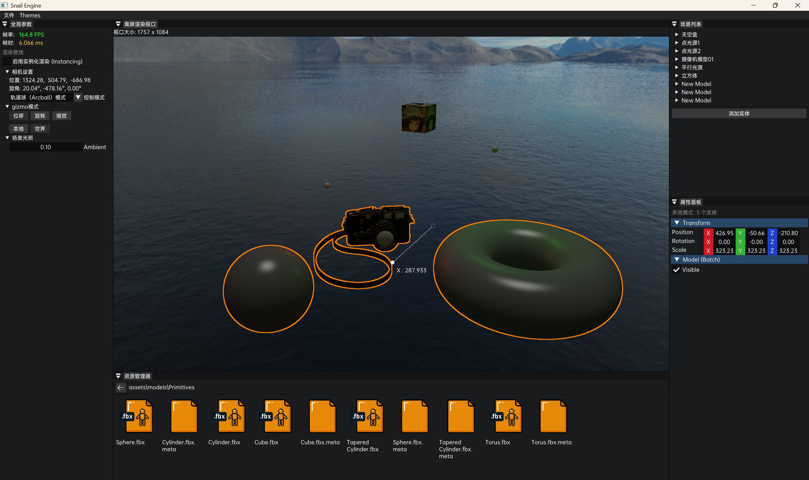
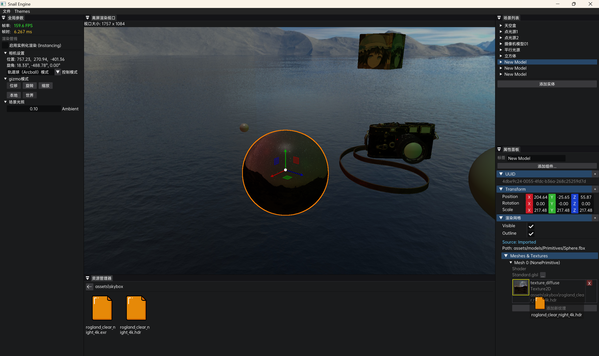
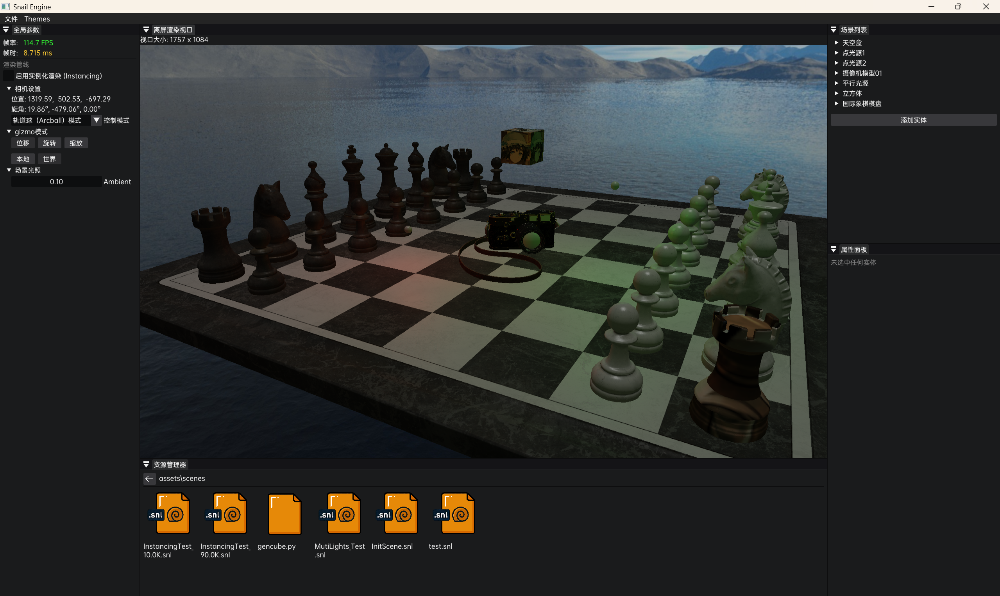
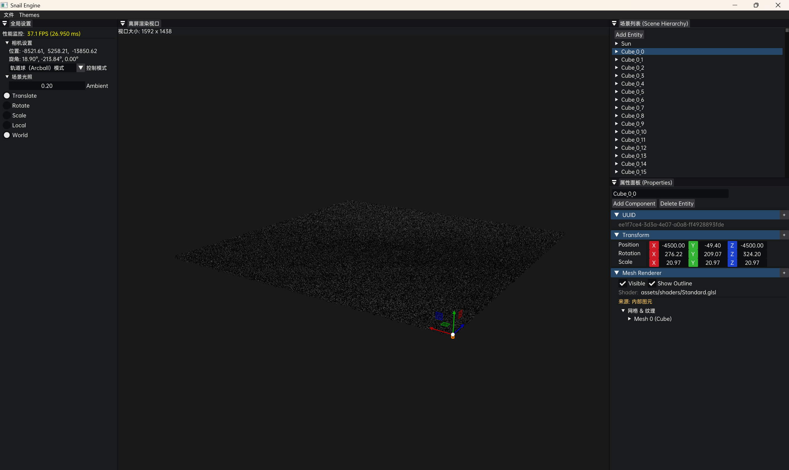

# Snail
## Ⅰ.介绍

基于TheCherno游戏引擎系列项目的前期架构，所建设的基于OpenGL的模型渲染系统（游戏引擎）项目，3D技术来自：https://learnopengl-cn.github.io/。


## Ⅱ.项目配置

克隆项目：

```
git clone https://github.com/Hanbly/Snail.git
```

初始化子模块：

```
git submodule update --init
```

运行根目录的 `GenProject.bat` 批处理文件，执行premake运行命令，以生成Visual Studio 解决方案，项目目前只支持Windows。


## Ⅲ.Engine

示例的模型资源请自行获取。

#### Operation Manual

| 分类         |     操作      |        按键        | 详细说明                                                     |
| ------------ | :-----------: | :----------------: | :----------------------------------------------------------- |
| **物体交互** |   选取物体    |      鼠标左键      | 点击物体进行单选；拖动 Gizmo 进行移动/旋转/缩放操作。        |
|              |   多选物体    | 左 Ctrl + 鼠标左键 | 按住 Ctrl 点击物体加入当前选择；在此状态下 Gizmo 有效。      |
|              |   仅操作轴    |  空格 + 鼠标左键   | 禁用物体选取功能，仅响应对 Gizmo 的操作。                    |
| **视角控制** |   旋转视图    |    鼠标中键拖动    | FPS 和 Arcball 模式。按住中键并拖动以旋转视角。              |
|              |   平移视图    |   Alt + 鼠标左键   | Arcball模式。按住 Alt 拖动左键平移视角中心。                 |
|              | 调整视场/距离 |      鼠标滚轮      | FPS模式： 调整视场角 (FOV)；Arcball模式： 调整视点距离 (推拉/缩放)。 |
|              |   场景漫游    |   W / A / S / D    | FPS模式。 前 / 左 / 后 / 右 移动相机位置。                   |
|              |   垂直升降    |       Q / E        | FPS模式。 下降 (Q) / 上升 (E) 相机高度。                     |

#### 物体选取：



#### 资源浏览器：



#### 多光源场景：



*Model by [Riley Queen] from [https://polyhaven.com/models]*

*Model by [Rajil Jose Macatangay] from [https://polyhaven.com/models]*

#### 实例化渲染（360K+顶点数据）：



> glm在debug模式缺乏优化，谨慎在debug模式运行；
>
> 本项目采用文本序列化和反序列化，谨慎渲染更多的顶点数据。


## Ⅳ.第三方库

项目集成的库及其官方仓库地址如下：

| **组件名称**       | **库名称**      | **官方 GitHub 链接**                          |
| ------------------ | --------------- | --------------------------------------------- |
| 日志系统           | spdlog          | <https://github.com/gabime/spdlog>            |
| 窗口管理           | GLFW            | <https://github.com/glfw/glfw>                |
| OpenGL 加载        | GLAD            | <https://github.com/Dav1dde/glad>             |
| 数学计算           | GLM             | <https://github.com/g-truc/glm>               |
| 图像加载           | stb_image       | <https://github.com/nothings/stb>             |
| exr加载            | tinyexr         | https://github.com/syoyo/tinyexr              |
| 压缩文件处理       | miniz           | https://github.com/richgel999/miniz           |
| 调试界面           | Dear ImGui      | <https://github.com/ocornut/imgui>            |
| 文件对话框         | ImGuiFileDialog | <https://github.com/aiekick/ImGuiFileDialog>  |
| 操作杆 (Gizmo)     | ImGuizmo        | <https://github.com/CedricGuillemet/ImGuizmo> |
| 模型导入           | Assimp          | <https://github.com/assimp/assimp>            |
| 实体组件系统 (ECS) | EnTT            | <https://github.com/skypjack/entt>            |
| 唯一标识符         | Boost.UUID      | <https://github.com/boostorg/uuid>            |
| 序列化             | yaml-cpp        | <https://github.com/jbeder/yaml-cpp>          |

> 注：
>
> - stb_image 仅图像相关头文件
> - tinyexr 暂不支持 DWAA & DWAB 压缩格式的资源
> - miniz 仅头文件，是 tinyexr 内置版本
> - EnTT 仅头文件