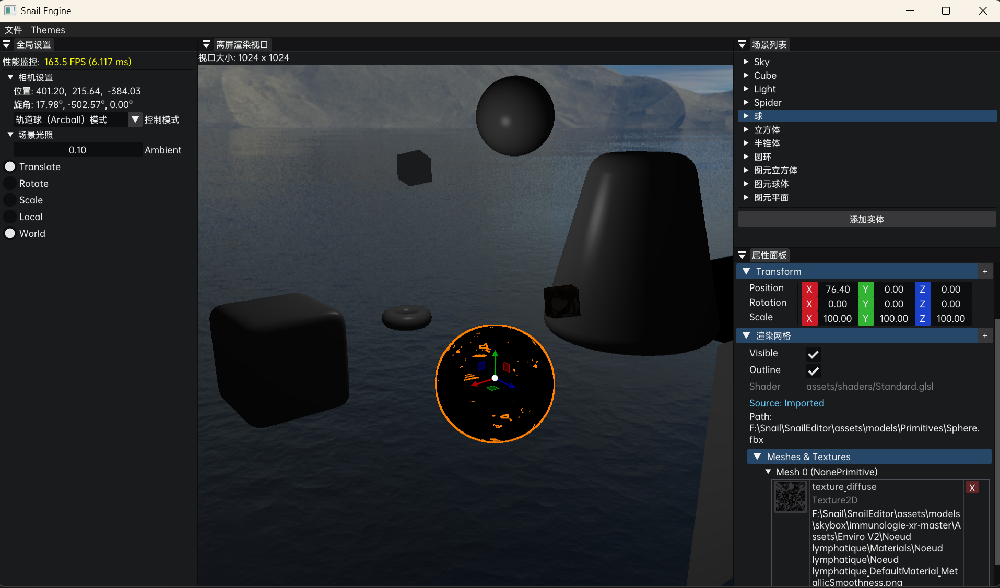
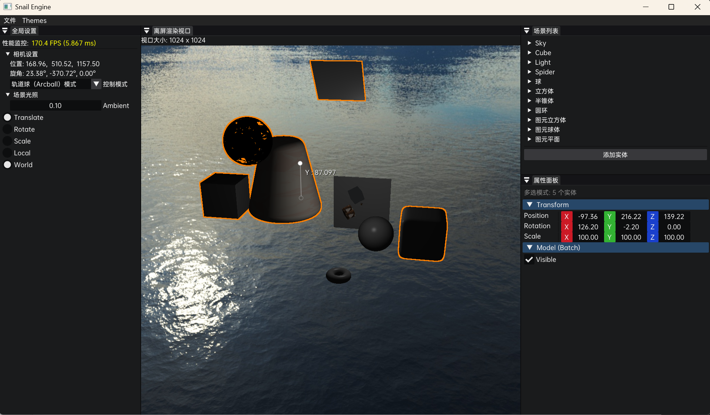

# Snail
## Ⅰ.介绍

基于TheCherno游戏引擎系列项目的前期架构，所建设的基于OpenGL的模型渲染系统（游戏引擎）项目，3D技术来自：https://learnopengl-cn.github.io/。


## Ⅱ.项目配置

克隆项目：

```
git clone https://github.com/Hanbly/Snail.git
```

初始化子模块：

```
git submodule update --init
```

运行根目录的 `GenProject.bat` 批处理文件，执行premake运行命令，以生成Visual Studio 解决方案，项目目前只支持Windows。


## Ⅲ.Engine

示例的模型资源请自行获取，路径：/assets/models/\*\*/\*.obj。





实例化测试（360K+顶点数据）。

> glm在debug模式缺乏优化，谨慎在debug模式运行。本项目采用文本序列化和反序列化，谨慎渲染更多的顶点数据。


## Ⅳ.第三方库

项目集成的库及其官方仓库地址如下：

| **组件名称**   | **库名称**      | **官方 GitHub 链接**                          |
| -------------- | --------------- | --------------------------------------------- |
| 日志系统       | spdlog          | <https://github.com/gabime/spdlog>            |
| 窗口管理       | GLFW            | <https://github.com/glfw/glfw>                |
| OpenGL 加载    | GLAD            | <https://github.com/Dav1dde/glad>             |
| 数学计算       | GLM             | <https://github.com/g-truc/glm>               |
| 图像加载       | stb_image       | <https://github.com/nothings/stb>             |
| 调试界面       | Dear ImGui      | <https://github.com/ocornut/imgui>            |
| 文件对话框     | ImGuiFileDialog | <https://github.com/aiekick/ImGuiFileDialog>  |
| 操作杆 (Gizmo) | ImGuizmo        | <https://github.com/CedricGuillemet/ImGuizmo> |
| 模型导入       | Assimp          | <https://github.com/assimp/assimp>            |
| 架构模式 (ECS) | EnTT            | <https://github.com/skypjack/entt>            |
| 唯一标识符     | Boost.UUID      | <https://github.com/boostorg/uuid>            |
| 序列化         | yaml-cpp        | <https://github.com/jbeder/yaml-cpp>          |

