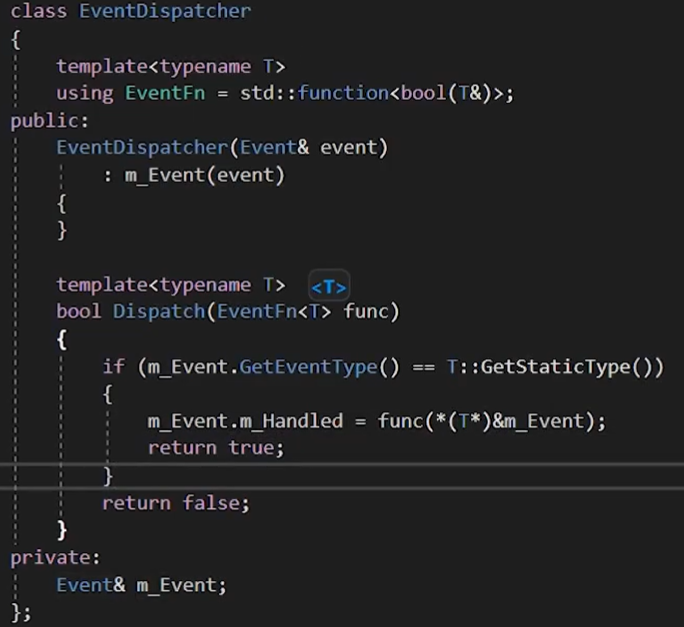

# 11.17事件分拣器EventDispatcher的笔记




我看不懂这个类，请你解释，我的Event系列类如下：

#pragma once

\#include "../Core.h"

\#include <string>
\#include <sstream>

enum class EventType {
None = 0,
AppTick, AppUpdate, AppRender,
KeyboardPress, KeyboardRelease,
MouseButtonPress, MouseButtonRelease, MouseMove, MouseScroll,
WindowResize, WindowMove, WindowClose, WindowFocus, WindowLostFocus,
};

enum EventCategory {
None = 0,
ApplicationCategoryEvent = BIT(0),
InputCategoryEvent = BIT(1),
KeyboardCategoryEvent = BIT(2),
MouseCategoryEvent = BIT(3),
MouseButtonCategoryEvent = BIT(4),
};

\#define EVENT_TYPE_FUNC_SET(type) 
static EventType GetStaticType() { return EventType::##type; }
virtual EventType GetEventType() const override { return GetStaticType(); }
virtual const char* GetEventName() const override { return #type; }

\#define EVENT_CATEGORY_FUNC_SET(category) 
virtual int GetEventCategoryFlags() const override { return category; }

class SNAIL_API Event {
protected:
bool m_Handled = false;
public:
virtual EventType GetEventType() const = 0;
virtual int GetEventCategoryFlags() const = 0;
virtual const char* GetEventName() const = 0;
virtual std::string ToString() const { return GetEventName(); }

codeCode


```
inline bool IsEventInCategory(int categoryflags) const {
	return GetEventCategoryFlags() & categoryflags;
}
```

};
，#pragma once

\#include "Event.h"

// ----------------------鼠标按钮事件抽象类------------------------------################################################
class SNAIL_API MouseButttonEvent : public Event {
protected:
int m_button;
MouseButttonEvent(int button)
: m_button(button) {}
public:
inline int GetMouseButton() const { return m_button; }

codeCode


```
EVENT_CATEGORY_FUNC_SET(InputCategoryEvent | MouseButtonCategoryEvent)
```

};
// ----------------------鼠标按钮输入事件------------------------------####################################################
class SNAIL_API MousePressEvent : public MouseButttonEvent {
public:
MousePressEvent(int button)
: MouseButttonEvent(button) {}

codeCode


```
std::string ToString() const override {
	std::stringstream ss;
	ss << "[鼠标按钮输入事件]:" << m_button << "\n";
	return ss.str();
}

EVENT_TYPE_FUNC_SET(MouseButtonPress)
```

};
// ----------------------鼠标按钮释放事件------------------------------####################################################
class SNAIL_API MouseReleaseEvent : public MouseButttonEvent {
public:
MouseReleaseEvent(int button)
: MouseButttonEvent(button) {}

codeCode


```
std::string ToString() const override {
	std::stringstream ss;
	ss << "[鼠标按钮释放事件]:" << m_button << "\n";
	return ss.str();
}

EVENT_TYPE_FUNC_SET(MouseButtonRelease)
```

};

// ----------------------鼠标移动事件------------------------------####################################################
class SNAIL_API MouseMoveEvent : public Event {
private:
float m_MouseX;
float m_MouseY;
public:
MouseMoveEvent(float mousex, float mousey)
: m_MouseX(mousex), m_MouseY(mousey) {}

codeCode


```
inline float GetMouseX() const { return m_MouseX; }
inline float GetMouseY() const { return m_MouseY; }

std::string ToString() const override {
	std::stringstream ss;
	ss << "[鼠标移动事件] 当前鼠标位置: X-" << m_MouseX << "|Y-" << m_MouseY << "\n";
	return ss.str();
}

EVENT_TYPE_FUNC_SET(MouseMove)
EVENT_CATEGORY_FUNC_SET(InputCategoryEvent | MouseCategoryEvent)
```

};
// ----------------------鼠标移动事件------------------------------####################################################
class SNAIL_API MouseScrollEvent : public Event {
private:
float m_MouseScrollOffsetX;
float m_MouseScrollOffsetY;
public:
MouseScrollEvent(float xoffset, float yoffset)
: m_MouseScrollOffsetX(xoffset), m_MouseScrollOffsetY(yoffset) {}

codeCode


```
inline float GetMouseScrollOffsetX() const { return m_MouseScrollOffsetX; }
inline float GetMouseScrollOffsetY() const { return m_MouseScrollOffsetY; }

std::string ToString() const override {
	std::stringstream ss;
	ss << "[鼠标滚动事件] 鼠标滚动偏移量: X轴偏移量-" << m_MouseScrollOffsetX << "|Y轴偏移量-" << m_MouseScrollOffsetY << "\n";
	return ss.str();
}

EVENT_TYPE_FUNC_SET(MouseScroll)
EVENT_CATEGORY_FUNC_SET(InputCategoryEvent | MouseCategoryEvent)
```

};等等


好的，没问题。这个 EventDispatcher 类是一个非常巧妙和常见的设计，用于将一个通用的 Event 对象分发给专门处理特定类型事件的函数。

我们来一步步解析它，并结合你提供的 Event 系列类代码来理解。

### 核心目的

EventDispatcher 的核心目的很简单：你有一个基类 Event 的引用，但你不知道它在运行时具体是 MousePressEvent 还是 MouseMoveEvent 或是其他类型的事件。这个类可以帮助你安全地、优雅地检查事件的具体类型，并调用只接受该特定类型事件的函数。

------


### 逐行代码解析 EventDispatcher

```
class EventDispatcher
{
```

这是一个名为 EventDispatcher 的类。

------


```
template<typename T>
using EventFn = std::function<bool(T&)>;
```

- **template<typename T>**: 这是一个模板 using 别名。这意味着 EventFn 不是一个固定的类型，而是依赖于一个模板参数 T。
- **using EventFn = ...**: 我们给 std::function<bool(T&)> 起了一个更短、更易读的名字 EventFn。
- **std::function<bool(T&)>**: 这代表一个“可调用对象”（比如一个函数、一个lambda表达式等），它：
  - 返回一个 bool 值。
  - 接受一个参数，类型是 T&（对类型 T 的引用）。

举个例子：

- 如果 T 是 MousePressEvent，那么 EventFn<MousePressEvent> 就是 std::function<bool(MousePressEvent&)>。
- 如果 T 是 MouseMoveEvent，那么 EventFn<MouseMoveEvent> 就是 std::function<bool(MouseMoveEvent&)>。

这个 bool 返回值通常用来表示“这个事件是否已经被处理了”。

------


```
public:
	EventDispatcher(Event& event)
		: m_Event(event)
	{
	}
```

- **public:**: 类的公共接口部分。
- **EventDispatcher(Event& event)**: 这是构造函数。它接收一个 Event 对象的引用。
- **: m_Event(event)**: 这是成员初始化列表。它将传入的 event 引用，用来初始化类内部的成员变量 m_Event。

这意味着当你创建一个 EventDispatcher 对象时，你必须给它一个具体的事件实例。这个分发器就是为这**一个**事件服务的。

------


```
template<typename T>
bool Dispatch(EventFn<T> func)
{
```

- 这是这个类的核心方法 Dispatch。
- **template<typename T>**: 这是一个模板方法。调用它的时候，你需要明确指定类型 T。例如 dispatcher.Dispatch<MousePressEvent>(...)。这里的 T 就是你**希望处理的那个具体事件类型**。
- **bool Dispatch(...)**: 这个方法本身也返回一个 bool，表示分发是否成功。
- **EventFn<T> func**: 参数是一个我们上面定义的 EventFn。也就是说，你传给 Dispatch 方法一个函数，这个函数必须能处理类型为 T 的事件。

------


```
if (m_Event.GetEventType() == T::GetStaticType())
	{
```

- 这是整个分发逻辑的关键。
- **m_Event.GetEventType()**: m_Event 是我们持有的那个 Event 引用。GetEventType() 是一个虚函数（在你的代码中），它返回这个事件实例在**运行时**的真实类型（EventType 枚举）。
- **T::GetStaticType()**: T 是你调用 Dispatch 时指定的**编译时**类型（比如 MousePressEvent）。GetStaticType() 是你在 EVENT_TYPE_FUNC_SET 宏里定义的**静态函数**。它返回 T 这个类所代表的事件类型。
- **==**: 这行代码在比较：“我手里这个事件的实际类型，和你现在想要处理的事件类型，是不是同一个？”

例如，如果 m_Event 实际上是一个 MousePressEvent 对象，然后你调用 dispatcher.Dispatch<MousePressEvent>(...)：

- m_Event.GetEventType() 会返回 EventType::MouseButtonPress。
- MousePressEvent::GetStaticType() 也会返回 EventType::MouseButtonPress。
- 条件成立，if 语句块内的代码会被执行。

如果你调用 dispatcher.Dispatch<MouseMoveEvent>(...)：

- m_Event.GetEventType() 依然返回 EventType::MouseButtonPress。
- MouseMoveEvent::GetStaticType() 会返回 EventType::MouseMove。
- 条件不成立，if 语句块被跳过。

------


```
m_Event.m_Handled = func(*(T*)&m_Event);
		return true;
	}
```

- 这段代码只在事件类型匹配时执行。
- **func(...)**: 调用你传进来的处理函数。
- ***(T\*)&m_Event**: 这是最需要理解的部分。
  1. &m_Event: m_Event 是一个 Event& 引用，& 取其地址，得到一个 Event* 指针。
  2. (T*): 这是一个 C 风格的强制类型转换。它把 Event* 指针强制转换成 T* 指针（例如，从 Event* 转成 MousePressEvent*）。这一步是安全的，**因为我们刚刚在 if 语句里已经确认了 m_Event 的真实类型就是 T**。
  3. *: 对转换后的 T* 指针进行解引用，得到一个 T& 类型的引用。
  4. 整个表达式的结果就是将基类 Event 的引用安全地转换为派生类 T 的引用，然后传递给 func 函数。
- **m_Event.m_Handled = ...**: func 函数会返回一个 bool。这个返回值被赋给事件的 m_Handled 标志。这是一种常见模式：如果一个处理函数成功处理了事件（比如一个UI按钮点击事件被按钮本身处理了），它就返回 true，并将事件标记为 "已处理"，这样事件就不会再被传递给其他对象（比如按钮后面的窗口）。
- **return true;**: Dispatch 方法返回 true，告诉调用者：“是的，我找到了一个匹配的处理函数，并且已经调用了它”。

------


```
return false;
}
```

- 如果 if 条件不满足（事件类型不匹配），就直接执行到这里，返回 false。这告诉调用者：“你想要处理的类型和当前事件的类型不匹配，我什么都没做”。

------


```
private:
	Event& m_Event;
};
```

- 类的私有成员，就是我们在构造函数里初始化的那个事件的引用。

### 总结与使用示例

这个 EventDispatcher 就像一个专业的邮件分拣员。

1. 你（OnEvent 函数）收到一封信（一个 Event& event），但信封上只写了“信件”，没写具体内容。
2. 你把这封信交给分拣员（EventDispatcher dispatcher(event);）。
3. 你告诉分拣员：“如果是‘账单’（MousePressEvent），就交给会计（你的 lambda 函数）处理”。
   - 分拣员（dispatcher）拆开信一看，发现真的是账单。
   - 他就把信交给会计，会计处理完后在信上盖个“已处理”的章（m_Handled = true）。
   - 分拣员告诉你：“处理成功了”（return true）。
4. 你又告诉分拣员：“如果是‘情书’（MouseMoveEvent），就交给秘书处理”。
   - 分拣员一看，发现这封信是“账单”不是“情书”。
   - 他什么都不做，并告诉你：“类型不匹配”（return false）。

**实际使用场景看起来是这样的：**


```
// 假设这是你程序里某个处理事件的函数
void Application::OnEvent(Event& event) 
{
    // 为收到的这一个 event 创建一个分发器
    EventDispatcher dispatcher(event);

    // 尝试将事件分发给一个处理 MousePressEvent 的函数 (用 lambda 表达式)
    // dispatcher.Dispatch<T>(func)
    dispatcher.Dispatch<MousePressEvent>([](MousePressEvent& e) -> bool {
        // 在这个 lambda 内部, 'e' 的类型就是 MousePressEvent&
        // 所以你可以安全地调用它特有的方法，比如 GetMouseButton()
        LOG_INFO("鼠标按键按下了: {0}", e.GetMouseButton());
        
        // 返回 true, 表示这个事件我们已经处理了, 不希望它再被传递
        return true; 
    });

    // 如果上面的 Dispatch 返回了 true, 并且设置了 event.m_Handled,
    // 我们可以在这里提前退出，避免不必要的检查。
    if (event.m_Handled) {
        return;
    }

    // 尝试将同一个事件分发给一个处理 MouseMoveEvent 的函数
    dispatcher.Dispatch<MouseMoveEvent>([](MouseMoveEvent& e) -> bool {
        // 在这里 'e' 的类型是 MouseMoveEvent&
        LOG_TRACE("鼠标移动到了: ({0}, {1})", e.GetMouseX(), e.GetMouseY());
        
        // 返回 false, 表示我们只是观察了这个事件，但并没有“消耗”它，
        // 其他层可能还关心这个事件。
        return false;
    });

    // ...可以继续为其他事件类型调用 Dispatch
}
```

这个设计的最大优点是**类型安全**和**代码整洁**。你不需要自己写一大堆 if/else if 和 dynamic_cast，而是用一种非常清晰、可扩展的方式来处理不同类型的事件。


------

问题1.为什么不这样写：if (m_Event.GetEventType == T::GetStaticType) {
m_Event.m_Handled = eventFunc((T&)m_Event);
return true;
}，如果我没理解错，源代码是否也是类似的类型转换的目的？2.m_Event.GetEventType == T::GetStaticType到底是如何实现的？什么情况下会判断为否？3.template<typename T>
using EventFn = std::function<bool(T&)>;是否类似于#define ...宏的作用？之后使用这个模板的时候为什么是EventFn<T> eventFunc而不是EventFn<T&> eventFunc或EventFn<bool(T&)> eventFunc等等？


你提的这几个问题都非常好，说明你正在深入思考这段代码的底层逻辑。我们来逐一拆解。

### 问题1：关于类型转换

> 为什么不这样写：
>
> ```
> m_Event.m_Handled = eventFunc((T&)m_Event);
> ```
>
> 如果我没理解错，源代码是否也是类似的类型转换的目的？

你的理解完全正确！这两种写法的**最终目的**是完全一样的：将基类 Event 的引用，向下转换（Downcast）为派生类 T 的引用。

我们来比较一下两种写法：

1. **你的写法：(T&)m_Event**
   - 这是 C++ 风格的 static_cast 的简写形式。完整的写法是 static_cast<T&>(m_Event)。
   - 这是一个**编译时**类型转换。你等于在告诉编译器：“请相信我，我知道 m_Event 这个引用实际上指向的是一个 T 类型的对象，请把它当成 T& 来用。”
   - **优点**：语法更简洁，意图更清晰，是现代 C++ 中在这种“我已经确认过类型”的情况下推荐的写法。
   - **安全性**：因为我们已经在 if 语句中通过 GetEventType() 检查了类型，所以在这里使用 static_cast 是绝对安全的。
2. **源代码的写法：\*(T\*)&m_Event**
   - 这是一个 C 风格的强制类型转换，它实际上执行了一系列操作：
     - &m_Event：获取 m_Event 所引用的对象的内存地址，得到一个 Event* 指针。
     - (T*)：将这个 Event* 指针**强制重新解释**为一个 T* 指针。它不改变地址，只是改变了编译器看待这个地址的方式。这在 C++ 中等价于 reinterpret_cast。
     - *：对这个新的 T* 指针进行解引用，得到一个 T& 的引用。
   - **优点**：在 C 语言和早期 C++ 中很常见。
   - **缺点**：可读性稍差，而且 C 风格转换过于强大，它会依次尝试 static_cast、const_cast、reinterpret_cast，可能会掩盖程序员的真实意图，被认为是不够安全和现代的实践。

**结论：**
你的写法 (T&)m_Event 不仅是可行的，而且是**更推荐、更现代、更清晰**的写法。源代码作者可能习惯于 C 风格的指针操作，或者是在一些旧的代码基础上编写的。两者在这个上下文中的效果完全相同，因为 if 语句保证了转换的安全性。

------


### 问题2：m_Event.GetEventType() == T::GetStaticType() 如何实现？

这行代码是整个 EventDispatcher 的灵魂，它巧妙地结合了**运行时多态**和**编译时模板**。

我们把它拆成两半看：

1. **左边：m_Event.GetEventType() (运行时)**
   - m_Event 是一个基类 Event 的引用。在程序运行时，它可能指向任何一个 Event 的派生类对象（比如 MousePressEvent、MouseMoveEvent 等）。
   - GetEventType() 是你在 Event 基类中声明的 virtual 函数。
   - **关键点**：因为 GetEventType() 是虚函数，所以 m_Event.GetEventType() 调用的是**运行时 m_Event 所指向的那个具体对象的函数版本**。
     - 如果 m_Event 指向一个 MousePressEvent 对象，这行代码就会调用 MousePressEvent::GetEventType()，返回 EventType::MouseButtonPress。
     - 如果 m_Event 指向一个 MouseMoveEvent 对象，它就会调用 MouseMoveEvent::GetEventType()，返回 EventType::MouseMove。
   - 所以，左边的值是在**程序运行时**根据事件的真实类型动态决定的。
2. **右边：T::GetStaticType() (编译时)**
   - T 是 Dispatch 方法的一个模板参数。当你这样调用时：dispatcher.Dispatch<MousePressEvent>(...)，编译器在**编译阶段**就会生成一个 Dispatch 函数的特化版本，其中所有的 T 都会被替换成 MousePressEvent。
   - GetStaticType() 是你在宏 EVENT_TYPE_FUNC_SET 中定义的 static 函数。
   - **关键点**：static 函数不依赖于任何对象实例，它属于类本身。所以 T::GetStaticType() 直接调用了那个**在编译时就已经确定的类**的静态函数。
     - 在 Dispatch<MousePressEvent> 的实例中，T::GetStaticType() 就等同于 MousePressEvent::GetStaticType()，它永远返回 EventType::MouseButtonPress。
     - 在 Dispatch<MouseMoveEvent> 的实例中，T::GetStaticType() 就等同于 MouseMoveEvent::GetStaticType()，它永远返回 EventType::MouseMove。
   - 所以，右边的值是在**编译时**根据你调用 Dispatch 时指定的类型静态决定的。

**总结与判断为否的情况：**

这行代码是在用一个**“运行时”的真实类型**去和你**“编译时”期望的类型**作比较。

**判断为否的情况举例：**
假设程序收到了一个鼠标点击事件。


```
// 运行时，event 实际上是一个 MousePressEvent 对象
MousePressEvent event(0); // 假设 0 代表左键
Application::OnEvent(event);

// 在 OnEvent 函数内部:
void Application::OnEvent(Event& e) {
    EventDispatcher dispatcher(e);

    // 第一次尝试分发
    dispatcher.Dispatch<MouseMoveEvent>(/*...处理鼠标移动的函数...*/);
}
```

在 dispatcher.Dispatch<MouseMoveEvent> 这个调用中：

- T 是 MouseMoveEvent。
- 左边：m_Event.GetEventType() -> m_Event 指向的是 MousePressEvent 对象，所以调用 MousePressEvent::GetEventType() -> 返回 EventType::MouseButtonPress。
- 右边：T::GetStaticType() -> MouseMoveEvent::GetStaticType() -> 返回 EventType::MouseMove。
- 比较：EventType::MouseButtonPress == EventType::MouseMove 的结果是 **false**。if 语句不执行，Dispatch 返回 false。

这样，EventDispatcher 就成功地阻止了将一个鼠标点击事件错误地分发给一个处理鼠标移动的函数。

------


### 问题3：关于 using EventFn = ...

> template<typename T> using EventFn = std::function<bool(T&)>; 是否类似于 #define ...宏的作用？之后使用这个模板的时候为什么是 EventFn<T> eventFunc 而不是 EventFn<T&> eventFunc 或 EventFn<bool(T&)> eventFunc 等等？

1. **using vs #define**
   它和 #define 目的相似（起别名），但实现方式和能力完全不同。using 是**远优于** #define 的现代化 C++ 特性。

   - **#define**：是预处理器指令，在编译前进行**纯粹的文本替换**。它不理解 C++ 语法、作用域和类型。例如 #define PINT int* 会在 PINT a, b; 中导致 a 是指针而 b 是 int 的经典错误。
   - **using**：是 C++ 语言的一部分，由编译器理解。它创建的是真正的**类型别名**，是类型安全的，并且尊重作用域。最重要的是，using 可以被模板化，就像你看到的这样，而 #define 无法做到这一点。所以它们不是一回事，using 更强大、更安全。

2. **为什么是 EventFn<T>？**
   这涉及到对模板别名（template alias）的理解。

   template<typename T> using EventFn = std::function<bool(T&)>;

   这行代码定义了一个**模板**，而不是一个具体的类型。你可以把它看成一个“类型生成器”或者一个“类型配方”。

   - **EventFn**：是这个配方的名字。
   - **<typename T>**：说明这个配方需要一个“原料”，这个原料必须是一个类型（typename），我们在这里叫它 T。
   - **= std::function<bool(T&)>**：这是配方的具体内容。它告诉编译器：“当你给我一个类型 T 作为原料时，我就生成一个 std::function<bool(T&)> 类型”。

   所以，EventFn 本身不是一个完整的类型，你必须给它提供模板参数 <...> 才能得到一个具体的类型。

   - 当你写 **EventFn<MousePressEvent>** 时：
     - 你把 MousePressEvent 这个类型作为原料 T 给了 EventFn 这个配方。
     - 编译器根据配方，生成了最终的类型：std::function<bool(MousePressEvent&)>。
     - 所以 EventFn<MousePressEvent> func 就是在声明一个名为 func 的变量，其类型是 std::function<bool(MousePressEvent&)>。

   **为什么不是 EventFn<T&> 或 EventFn<bool(T&)>？**

   - **EventFn<T&>**：这是错误的，因为 EventFn 的配方要求一个**类型名**作为原料（typename T）。T& 是“对类型T的引用”，而不是一个独立的类型名。如果你传入 T&，编译器会尝试将配方中的 T 替换为 T&，得到 std::function<bool((T&)&)>，即“对引用的引用”，这是非法的 C++ 语法。
   - **EventFn<bool(T&)>**：这也是错误的。EventFn 的配方只接受**一个**模板参数（类型 T）。而 bool(T&) 是一个函数签名，不是一个类型。你等于给了一个需要“苹果”的配方一个“苹果派的制作方法”，原料类型不匹配。

简单来说，模板别名 EventFn<T> 就像一个函数 f(x) = x + 1。你调用时写 f(5)，而不是 f(5+1)。T 就是那个 x，你只需要提供最基础的那个类型原料即可。